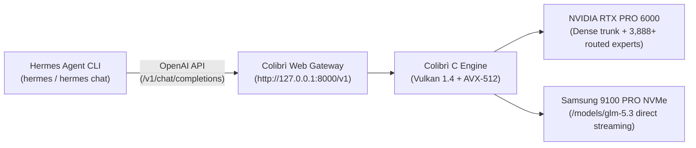

# Using GLM-5.3 Locally with Hermes Agent

This guide documents how to configure, optimize, and use the locally served **GLM-5.3 744B** model (running on the Colibrì pure-C inference engine) with **Hermes Agent**.

---

## 1. Architecture Overview



- **Backend Server:** Colibrì HTTP gateway listening on `http://127.0.0.1:8000/v1`.
- **Model ID:** `glm-5.2-colibri`.
- **Client Framework:** Hermes Agent CLI (`/root/.local/bin/hermes`), configured with Nous Research's agent loop, tool calling, and workspace context.

---

## 2. Configuration Steps

### A. Persistent Configuration in `~/.hermes/config.yaml`

Hermes natively supports custom OpenAI-compatible endpoints via the `custom` provider scheme. Run the following commands to configure Hermes:

```bash
# 1. Define the Colibrì local provider endpoint
hermes config set providers.colibri.base_url http://127.0.0.1:8000/v1

# 2. Set the default model and provider
hermes config set model.default glm-5.2-colibri
hermes config set model.provider custom:colibri
hermes config set model.base_url http://127.0.0.1:8000/v1
```

Verify your configuration with:
```bash
hermes config
```

### B. Environment Variable Overrides (Alternative)

If running in isolated shell scripts or non-persistent environments, you can point Hermes to Colibrì dynamically:

```bash
export CUSTOM_BASE_URL="http://127.0.0.1:8000/v1"
export HERMES_INFERENCE_MODEL="glm-5.2-colibri"
```

---

## 3. Performance & Prompt Size Tuning

### The Challenge of Large System Prompts on Local Hardware
By default, Hermes is configured for cloud frontier models (Claude 3.7 / GPT-4.5) and bundles **24 tool schemas** and **53 preloaded skills** into every prompt (~14,000 tokens of prefill). On a local 744B parameter MoE model, prefilling 14k tokens per turn takes significant compute time.

### Recommendation 1: Trim Unused Toolsets (High Impact)
Configure Hermes to only load essential coding tools (`terminal` and `file`) for the CLI platform:

```bash
hermes config set platform_toolsets.cli "[terminal, file]"
```

*Result:*
- Tool schemas drop from 24 tools (43.5 KB) down to 8 tools (13.8 KB).
- Total prompt size drops from ~14,000 tokens down to ~6,000 tokens.
- **Prefill computation speedup: ~5× faster.**

### Recommendation 2: Direct Q&A / Pure Chat (Zero Tools)
For conversational queries where tool execution is not needed, disable tools dynamically:

```bash
hermes chat -q "Explain quantum entanglement in simple terms" --oneshot -t ""
```

### Recommendation 3: Isolated Mode for Quick Tasks
To bypass auto-injection of repository files (`AGENTS.md`), memory, and skills:

```bash
hermes chat -q "Write a Python script to sort a list of dictionaries" --oneshot --ignore-rules
```

---

## 4. How to Use Hermes with GLM-5.3

### 1. Interactive Chat Session (Classic REPL)
```bash
hermes --cli
```

### 2. Modern Terminal User Interface (TUI)
```bash
hermes --tui
```

### 3. Single-Query / One-Shot Mode
```bash
hermes chat -q "Analyze the performance of this git repository" --oneshot
```

### 4. Headless Scripting / Piping (`-z`)
```bash
hermes -z "Generate a bash one-liner to find all *.spv files"
```

---

## 5. Colibrì Server Management Reference

| Action | Command |
|---|---|
| Check server status | `python3 c/coli status` |
| View live server logs | `python3 c/coli logs` |
| Stop background server | `python3 c/coli stop` |
| Start background server (tuned) | `COLI_VK_CHAIN_ROWS=512 KV8=0 python3 c/coli start --background --no-browser` |
| Health check endpoint | `curl http://127.0.0.1:8000/health` |
