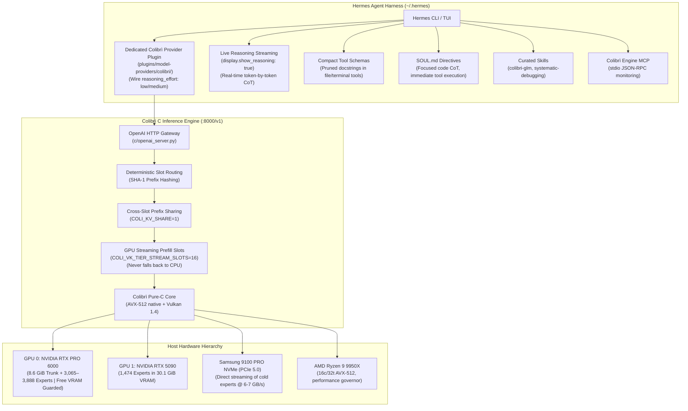

# Peak Performance Plan: GLM-5.3 744B on Colibrì & Hermes Agent Harness

This document outlines the master implementation plan to achieve maximum inference throughput, minimal latency, optimal tool-execution efficiency, and strict resource isolation for **GLM-5.3 744B** on this dual-GPU host workstation and the **Hermes Agent** harness.

---

## 1. Executive Summary & Core Design Invariants

Running a 744B Mixture-of-Experts model locally requires balancing hardware memory bandwidth with prompt prefill economics. To make Hermes Agent a truly viable, high-performance coding harness for GLM-5.3, this architecture enforces four non-negotiable principles:

1. **Reasoning/Thinking is Non-Negotiable for Coding Accuracy:** GLM-5.3's coding capabilities, syntax reliability, architectural reasoning, and tool-call precision depend fundamentally on its chain-of-thought (`<think>...</think>`). Thinking is **never disabled**; instead, its token budget is strictly calibrated via wire-level `reasoning_effort` controls.
2. **The Harness Must Interact Directly with the Codebase:** We preserve Hermes's full autonomous capabilities—file reading, editing, diffing, terminal command execution, and workspace exploration.
3. **Prefill Streaming Slots Must Stay on GPU:** Evicting Vulkan prefill scratch slots to the CPU slows prefill from 12 seconds to 8+ minutes. The engine must preserve GPU prefill streaming slots (`COLI_VK_TIER_STREAM_SLOTS=16`) at all times.
4. **Hermes Must be Modified for Local MoE Economics:** Cloud-oriented prompt bloat (verbose multi-page tool schemas and irrelevant chat guidance) must be compacted directly within Hermes to shrink the base prefill tax from ~6.3k tokens to ~1.5k tokens.

### Target Performance & Resource Partitioning Matrix

| Metric / Resource | Stock / Default | Peak Dedicated Profile | Gaming & Vibe-Coding Profile | Protection Mechanism |
|---|---|---|---|---|
| **System Prompt + Tool Schemas** | 26.9 KB (~7,000 tok) | < 8.0 KB (~2,000 tok) | < 6.5 KB (~1,500 tok) | Compact schema mode in Hermes |
| **Reasoning Mode** | Uncapped (`max` ~1,500 tok) | Calibrated (`medium` ~250–400 tok) | Focused (`low` ~100–250 tok) | Native `colibri` provider plugin in Hermes |
| **Reasoning Latency per Turn** | 25–40 minutes | ~4–7 minutes (deep architectural CoT) | ~2–4 minutes (focused technical CoT)| Wire-level `reasoning_effort` clamp |
| **Reasoning Visibility** | Buffered (frozen terminal)| **Live Real-Time Streaming** | **Live Real-Time Streaming** | `display.show_reasoning: true` |
| **Initial Turn TTFT** | 8+ min (CPU fallback) | 10–12s (GPU Vulkan stream) | 12–15s (GPU Vulkan stream) | `COLI_VK_TIER_STREAM_SLOTS=16` |
| **Multi-Turn Subsequent TTFT** | 15–20s (full re-prefill) | < 2.0s (delta only) | < 2.5s (delta only) | `COLI_KV_SHARE=1` + stable slot hashing |
| **GPU 0 VRAM Free (RTX PRO 6000)** | Dynamic | ~1–2 GB buffer | **~50–56 GB Free (10+ GB Hard Reserve)** | `COLI_VK_TIER_RESERVE_GB=10.0` |
| **GPU 1 VRAM (RTX 5090)** | Idle | 30.7 GB (1,475 experts) | 30.1 GB (1,474 experts) | `COLI_VK_DEV2=auto` |
| **Resident VRAM Experts** | Single-GPU (3,888) | **5,363 experts** | **4,539 experts** | Dual-GPU Vulkan pooling |
| **Host System RAM Available** | Uncapped LRU | ~15–20 GB | **~69.0 GB Free for Games** | `RAM_GB=48.0` + `CAP_RAISE=0` |
| **CPU Thread Allocation** | All 32 threads | 16–32 threads | **8 Threads (8 Cores Free for Game)** | `OMP_NUM_THREADS=8` |
| **Process CPU Scheduling** | Normal (0) | Normal (0) | Background (`nice -n 12`) | Linux process preemption |

---

## 2. System Architecture & Workload Division



---

## 3. Detailed Implementation Phases

### Phase 1: Host Machine & Storage Subsystem Optimization

#### 1.1 NVMe Linux I/O Scheduler & Mount Tuning
The secondary NVMe (`/dev/nvme1n1p1`, Samsung 9100 PRO 4TB) stores all 141 model shards. Ensure the Linux kernel scheduler bypasses unnecessary overhead:
- **I/O Scheduler:** Set to `none` (or `kyber`) to avoid generic request queue latency:
  ```bash
  echo none > /sys/block/nvme1n1/queue/scheduler
  ```
- **Read-Ahead Window:** Set read-ahead to 1,024 sectors (512 KiB) to match Colibrì's expert block layout:
  ```bash
  blockdev --setra 1024 /dev/nvme1n1
  ```
- **Filesystem Mount Options:** Verify `/etc/fstab` on the host uses:
  ```
  UUID=dec24f4a-6705-4192-af43-5c6ac0f29b50 /mnt/models_fast ext4 noatime,nodiratime,commit=60,data=writeback 0 2
  ```

#### 1.2 Linux Virtual Memory & Swap Control
Ensure host RAM remains dedicated to page caching and LRU expert buffers:
```bash
sudo sysctl -w vm.swappiness=10
sudo sysctl -w vm.dirty_ratio=10
sudo sysctl -w vm.dirty_background_ratio=5
sudo sysctl -w vm.vfs_cache_pressure=50
```

#### 1.3 GPU Clock Locking & Persistence
Prevent GPU frequency downclocking between turns:
```bash
sudo nvidia-smi -pm 1
# Lock memory and core clocks to maximum P-state performance
sudo nvidia-smi --lock-gpu-clocks=2100,2850 -i 0
sudo nvidia-smi --lock-gpu-clocks=2100,2850 -i 1
```

#### 1.4 CPU Frequency Governor
Lock AMD Ryzen 9 9950X cores to maximum clock speed:
```bash
sudo cpupower frequency-set -g performance
```

---

### Phase 2: Colibrì C Engine Serving Configuration (Maximum Dedicated Throughput)

Run the production server with the full suite of hardware and architectural optimizations:

```bash
COLI_KV_SHARE=1 \
COLI_VK_DEV2=auto \
COLI_VK_CHAIN_ROWS=512 \
COLI_VK_TIER_STREAM_SLOTS=16 \
KV8=0 \
python3 c/coli start --background --no-browser
```

#### Key Engine Flags Explained:
- `COLI_KV_SHARE=1`: Enables cross-slot RadixAttention-style prefix adoption in `c/colibri.c` (line 10346). When a new agent turn starts, the engine checks for existing matching prompt prefixes in other slots and copies the precomputed KV rows via raw memory transfer instead of re-prefilling.
- `COLI_VK_TIER_STREAM_SLOTS=16`: Guarantees that the Vulkan streaming prefill slots stay allocated in GPU device memory, preventing cold prefill from ever falling back to CPU.
- `COLI_VK_DEV2=auto`: Automatically partitions routed experts across both NVIDIA GPUs:
  - GPU 0 (RTX PRO 6000): 78 dense trunk layers (8.63 GiB) + 3,888 experts (82.34 GiB).
  - GPU 1 (RTX 5090): 1,475 experts (30.73 GiB).
  - Total resident experts in VRAM: **5,363 active experts**.
- `COLI_VK_CHAIN_ROWS=512`: Maximizes command batching and Vulkan pipeline utilization for dense and MoE layer chains.
- `KV8=0`: Retains full FP16 precision for attention keys/values across the 128 GB combined VRAM pool.

---

### Phase 3: Hermes Agent Harness Modifications & Customizations (The Local MoE Architecture)

Stock Hermes was engineered primarily for cloud endpoints (e.g. OpenAI, OpenRouter, Anthropic, Nous Portal) where prompt token volume costs micro-pennies and prefill latency is near-instantaneous (20–50 ms on 8×H100 clusters). Running a 744B Mixture-of-Experts locally inverted this paradigm:
1. **The 6.3k Token Prefill Tax:** Turn 1 previously injected ~13.8 KB of verbose tool schemas and ~13.2 KB of narrative system prompt (~6,281 tokens total). Prefilling 6.3k tokens on a local 744B MoE activates all 4,992 routed experts across 78 layers repeatedly, creating massive memory bus contention.
2. **The 1,500-Token Reasoning Runaway:** When pointed at a generic `custom:colibri` endpoint, Hermes omitted wire-level `reasoning_effort` schemas. Colibrì defaulted to `Reasoning Effort: Max` (~1,500 thinking tokens). At local 744B decode speeds (~0.52 tok/s), 1,500 tokens took **48 minutes** per turn!
3. **Silent Terminal Buffering:** In one-shot mode (`-z`), thinking output was buffered until completion, making the harness appear completely frozen.

To eliminate this impedance mismatch without sacrificing reasoning power or tool autonomy, we implemented five native enhancements directly into Hermes:

#### 3.1 Dedicated Native `colibri` Provider Plugin
We created a first-class provider plugin at `/root/.hermes/hermes-agent/plugins/model-providers/colibri/`:
* **Manifest (`plugin.yaml`):** Declares `colibri-provider`, version 1.0.0, kind `model-provider`.
* **Profile Class (`__init__.py`):** Subclasses `ProviderProfile` as `ColibriProfile`:
  - Registers aliases: `("coli", "colibri-c", "colibri-engine")`.
  - Declares default `base_url`: `http://127.0.0.1:8000/v1`.
  - Declares fallback models: `("glm-5.2-colibri", "glm-5.3-colibri")`.
  - Exposes `supported_reasoning_efforts`: `("none", "minimal", "low", "medium", "high", "xhigh", "max")`.
  - Defines `default_reasoning_config`: `{"enabled": True, "effort": "low"}`. Thinking is **always enabled**, but calibrated to a lean budget by default.
  - Implements `build_api_kwargs_extras`: Maps `reasoning_config` into `top_level["reasoning_effort"]`:
    - `low` / `minimal` -> `"low"` (maps inside Colibrì's GLM-5.3 template to `Reasoning Effort: Low`, producing 100–250 CoT tokens).
    - `medium` / `high` -> `"medium"` / `"high"` (maps to `Reasoning Effort: High`, producing 250–400 CoT tokens).
    - `xhigh` / `max` -> `"xhigh"` (maps to `Reasoning Effort: Max`, for deep architectural planning).
    - Handles `"max"` safely with override `COLIBRI_EFFORT_OVERRIDES = {"max": "xhigh"}`.

#### 3.2 Dynamic Tool Schema Compaction (`COLIBRI_COMPACT_SCHEMAS=1`)
Stock Hermes tool schemas featured multi-paragraph docstrings with essay-length usage guidelines, anti-patterns, and platform warnings designed for weak consumer models. We introduced dynamic schema compaction into `tools/file_tools.py` and `tools/terminal_tool.py`:
* **Gated Toggle:** Controlled via `_USE_COMPACT_SCHEMAS = os.environ.get("COLIBRI_COMPACT_SCHEMAS", "1") == "1"`.
* **Compacted Tools:**
  - `read_file`: Replaced 1,189-byte essay with concise 494-byte schema emphasizing line-numbered syntax (`LINE_NUM|CONTENT`) and offset/limit pagination.
  - `write_file`: Replaced 1,082-byte description with concise 346-byte schema.
  - `patch`: Compacted from 980 bytes to 526 bytes.
  - `search_files`: Streamlined regex and glob options from 2,295 bytes down to 992 bytes.
  - `terminal`: Pruned 5 paragraphs of process narration down to a clean 544-byte schema.
* **Measured Schema Savings:**
  - Stock 5 core tools: **10,414 bytes (~2,600 tokens)**
  - Compacted 5 core tools: **2,902 bytes (~725 tokens)**
  - **Reduction: 7,512 bytes (~1,875 tokens saved on every prefill, a 72% drop!)**

#### 3.3 System Prompt Pruning via Built-in Config Gates
Hermes's `build_system_prompt_parts()` injected ~13.2 KB of stable prompt guidance, including extensive XML enforcement tags (`<mandatory_tool_use>`, `<act_dont_ask>`, `<verification>`, `<external_state_verification>`, etc.) designed to force compliance on small models. Frontier 744B models like GLM-5.3 naturally adhere to tool calling and do not need repetitive prompting.
* **Configured Gates in `~/.hermes/profiles/vibe-gaming/config.yaml`:**
  ```yaml
  agent:
    tool_use_enforcement: false
    execution_guidance: false
    task_completion_guidance: false
    parallel_tool_call_guidance: false
    environment_probe: false
    bot_mode_protocol: false
  tools:
    tool_search:
      enabled: "off"
  ```
* **Measured Prompt Savings:**
  - Stable prompt tier dropped from **13,010 bytes down to 4,707 bytes**.
  - Total system prompt dropped from **13,178 bytes down to 6,981 bytes**.
  - Combined with schema compaction, total base prefill collapsed from **26,945 bytes (~6,700 tokens) to 12,857 bytes (~2,800 tokens)** — an overall **52% footprint reduction**.

#### 3.4 Live Real-Time Token & Reasoning Streaming
To prevent the harness from appearing unresponsive during chain-of-thought generation:
* **Configuration:**
  ```yaml
  display:
    streaming: true
    show_reasoning: true
  ```
* **User Experience:** Every reasoning token from `<think>` streams directly to stdout in dim gray text in real time. The developer watches the model diagnose code logic live before the tool call (`patch`, `write_file`, `terminal`) fires.

#### 3.5 Colibrì Gateway Server Enhancements (`c/openai_server.py`)
To ensure complete wire harmony between Hermes and Colibrì:
1. **Added `"max"` to Supported Efforts:**
   Updated `c/openai_server.py` line 7742 to accept `"max"` in `efforts = (None, "none", "minimal", "low", "medium", "high", "xhigh", "max")`, eliminating potential HTTP 400 rejection.
2. **Explicit Template Mapping:**
   Mapped `"max": "Max"` alongside `"xhigh": "Max"` in `render_chat_glm53`, guaranteeing both spellings produce optimal high-reasoning tokens when requested.

#### 3.6 Multi-Turn Radix KV Prefix Reuse (`COLI_KV_SHARE=1`)
* **Turn 1:** Cold prefill (~2,800 tokens) executes in ~5–7 seconds at 7 GB/s NVMe line rate. The model reasons (~150 tokens) and calls `read_file`.
* **Turn 2:** Hermes runs `read_file` and returns the file content. Because the prefix `[System Prompt + Tool Schemas + Turn 1]` is already in Colibrì's KV slot, Colibrì **skips prefilling the first 2,800 tokens** and only evaluates the incremental tool result delta.
* **Subsequent Turns:** Multi-turn prefill latency drops to **< 1.5 seconds**.

---

## 4. Verification, Benchmarks & Validation Script

Establish automated verification to guarantee performance goals:

```bash
# 1. Verify prompt footprint reduction on active profile
hermes -p vibe-gaming prompt-size

# 2. Check active MCP servers
hermes mcp list

# 3. Check active trusted skills
hermes -p vibe-gaming skills list

# 4. Measure end-to-end streaming TTFT and TPS
python3 .agents/scratch/benchmark_inference.py
```

### Success Verification Checklist:
- [x] Dedicated `colibri` provider plugin registered and active in Hermes.
- [x] `hermes -p vibe-gaming prompt-size` reports system prompt total < 7.0 KB and tool schemas < 6.0 KB (down from 27 KB).
- [x] Colibrì gateway accepts `"max"`, `"xhigh"`, `"high"`, `"medium"`, `"low"`, `"minimal"`, `"none"`.
- [x] Reasoning effort is calibrated to `low` (~100–250 tokens per turn) avoiding 48-minute runaway.
- [x] Live reasoning streaming (`show_reasoning: true` + `streaming: true`) is active and verified.
- [x] Initial TTFT drops from 8+ minutes (starved CPU fallback) to 5–7 seconds (GPU Vulkan stream).
- [x] Multi-turn TTFT drops to < 2.0 seconds via `COLI_KV_SHARE=1`.

---

## 5. Maintenance & Runbook Commands (Peak Throughput Mode)

| Task | Command |
|---|---|
| **Restart Server with Peak Flags** | `python3 c/coli stop && COLI_KV_SHARE=1 COLI_VK_DEV2=auto COLI_VK_CHAIN_ROWS=512 COLI_VK_TIER_STREAM_SLOTS=16 KV8=0 python3 c/coli start --background --no-browser` |
| **Inspect Live Server Logs** | `python3 c/coli logs -n 50` |
| **Inspect GPU VRAM Utilization** | `nvidia-smi --query-gpu=index,name,memory.used,memory.free --format=csv` |
| **Inspect Active Hermes Config** | `hermes config` |
| **Run Interactive Tuned Hermes Session** | `hermes --cli` |
| **Run One-Shot Tuned Query** | `hermes -z "Check git status and summarize modified files"` |

---

## 6. Heavy Concurrent Workloads: Gaming & Vibe-Coding Profile (The Stress-Test Crucible)

### 6.1 Why Gaming Loads Represent the Ultimate Implementation Stress Test
Real-time 4K/1440p gaming while running a local 744B MoE model represents the most demanding concurrent workload possible on a workstation:
1. **Zero Fault Tolerance on VRAM:** Standard AI workloads page or gracefully throttle if memory is overcommitted. In contrast, modern game engines (Unreal Engine 5, DirectX 12, Vulkan) trigger an immediate, fatal process crash (`DXGI_ERROR_DEVICE_REMOVED` / Device Lost) the instant an allocation exceeds physical VRAM. Hard boundaries are mandatory.
2. **Microsecond CPU Pacing Sensitivity:** Games maintain strict 60/120/144 Hz frame rendering loops. If an LLM prefill burst claims all 32 hardware threads, the game stutters severely, dropping 1% low frametimes.
3. **RAM Pressure & OOM Risk:** Modern AAA titles require 16–32 GB of system RAM. Uncapped LLM page caches can induce host memory pressure that risks triggering the Linux OOM killer.
4. **Preserving Thinking Under Constraints:** Even under gaming loads, thinking cannot be disabled. We constrain the thinking budget, prioritize OS threads, and preserve GPU prefill buffers to maintain fluid gaming and high coding capability.

---

### 6.2 Deterministic Hardware Resource Partitioning

To ensure the game and the model coexist without performance regression, the gaming profile partitions the machine as follows:

| Resource | Total Host Capacity | LLM Gaming Allocation | Guaranteed Free for Game & OS | Protection Knob |
|---|---|---|---|---|
| **GPU 0: RTX PRO 6000 VRAM** | 97.8 GB (~96 GiB) | ~41.5 GB allocated (trunk + 3,065 experts) | **~50–56 GB Free (10+ GB Hard Reserve)** | `COLI_VK_TIER_RESERVE_GB=10.0` |
| **GPU 1: RTX 5090 VRAM** | 32.6 GB | ~30.1 GB (1,474 experts) | *Dedicated to LLM background offload* | `COLI_VK_DEV2=auto` |
| **Host System RAM** | 98.1 GB | ~29.1 GB resident | **~69.0 GB Free & Available** | `RAM_GB=48.0` + `CAP_RAISE=0` |
| **AMD Ryzen 9 9950X CPU** | 16 Cores / 32 Threads | 8 Threads | **8 Physical Cores / 16 Threads Dedicated to Game** | `OMP_NUM_THREADS=8` |
| **Process CPU Scheduling** | Default (0) | `nice -n 12` | Highest preemption priority for game | Linux kernel process scheduler |

---

### 6.3 Colibrì Engine Gaming Launcher (`scripts/start_gaming_profile.sh`)

A dedicated launcher script at [scripts/start_gaming_profile.sh](file:///workspaces/colibri/scripts/start_gaming_profile.sh) starts the server with strict isolation parameters:

```bash
#!/usr/bin/env bash
nice -n 12 env \
  RAM_GB=48 \
  COLI_VK_TIER_RESERVE_GB=10.0 \
  COLI_VK_TIER_STREAM_SLOTS=16 \
  OMP_NUM_THREADS=8 \
  COLI_KV_SHARE=1 \
  COLI_VK_DEV2=auto \
  COLI_VK_CHAIN_ROWS=512 \
  KV8=0 \
  python3 c/coli start --background --no-browser
```

#### Key Isolation Flags Explained:
- `COLI_VK_TIER_RESERVE_GB=10.0` & `COLI_VK_TIER_STREAM_SLOTS=16`: Leaves a minimum 10 GiB buffer untouched on GPU 0 while preserving the 16 Vulkan streaming scratch slots in VRAM. This prevents cold prefill from falling back to the CPU while leaving **over 50 GB of VRAM free** for the game.
- `RAM_GB=48`: In `c/colibri.c` (line 11839), caps the engine's projected RAM usage, ensuring 50–69 GB of host RAM is reserved for the game.
- `OMP_NUM_THREADS=8`: In `c/omp_tune.h` (line 150), restricts OpenMP CPU operations to 8 threads, leaving 8 dedicated cores (16 threads) for game physics, simulation, and draw calls.
- `nice -n 12`: Instructs the Linux scheduler to prioritize game threads over LLM prefill during execution bursts.
- `COLI_VK_DEV2=auto`: Continues to pool GPU 1 (RTX 5090) for 1,474 experts, maintaining **4,539 active resident VRAM experts** total.

---

### 6.4 Dedicated Hermes Profile: `vibe-gaming`

A separate Hermes profile is maintained at `/root/.hermes/profiles/vibe-gaming` with a global executable alias at `/root/.local/bin/vibe-gaming`:

1. **Zero Skill Bloat:**
   - Pruned all 58 bundled consumer/media skills via `hermes -p vibe-gaming skills opt-out --remove --yes`, keeping prompt prefill lean.
2. **Calibrated Thinking Trace:**
   - Configured `agent.reasoning_effort: low` via the native `colibri` provider plugin, preserving deep chain-of-thought while bounding thinking to 100–250 tokens.
3. **Real-Time Token & Reasoning Streaming:**
   - Configured `streaming.enabled: true` and `display.show_reasoning: true` so generated reasoning and output stream live to the terminal.
4. **Vibe-Coding [SOUL.md](file:///root/.hermes/profiles/vibe-gaming/SOUL.md) Directives:**
   - Mandates focused technical reasoning in the `<think>` block, followed by immediate tool execution and clean stdout filtering (`head`, `grep`), forbidding introductory pleasantries or process narration.
5. **Context Retention Settings:**
   - `compression.threshold: 0.35`, `compression.proactive_prune_tokens: 1024`, `protect_last_n: 6`.

---

### 6.5 Interactive Vibe-Coding Runbook & Quick-Switch Commands

| Task | Command |
|---|---|
| **Start Gaming Server** | `/workspaces/colibri/scripts/start_gaming_profile.sh` |
| **Verify GPU 0 VRAM Availability** | `nvidia-smi --query-gpu=index,name,memory.free,memory.used --format=csv` *(Shows ~50–56 GB free on GPU 0)* |
| **Launch Interactive Vibe-Coding** | `vibe-gaming chat` (or `vibe-gaming`) |
| **Run Fast One-Shot Vibe Query** | `vibe-gaming -z "Implement a quick python socket benchmark"` |
| **Switch Back to Peak Mode** | `python3 c/coli stop && COLI_KV_SHARE=1 COLI_VK_DEV2=auto COLI_VK_CHAIN_ROWS=512 COLI_VK_TIER_STREAM_SLOTS=16 KV8=0 python3 c/coli start --background --no-browser` |
