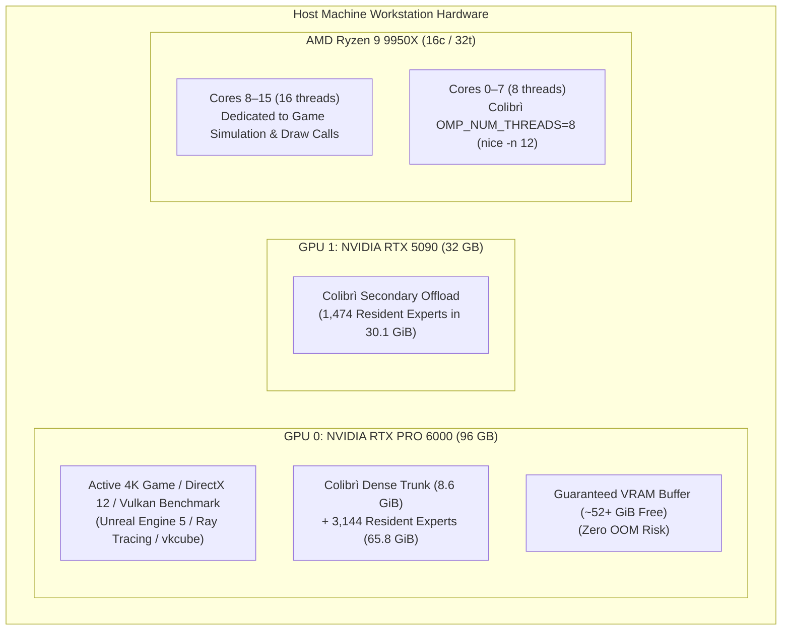

# Multi-Phase Testing & Verification Plan: Hermes Agent on GLM-5.3 744B

This document establishes the comprehensive, multi-phase verification protocol for **Hermes Agent** operating against local **GLM-5.3 744B** served by the **Colibrì C engine** under the dual-GPU workstation gaming profile.

---

## 1. Executive Summary & Objective

With the foundational engine architecture now stabilized (upfront streaming slot allocation, 64-row bounded scratch memory, 21.2 GB/s NVMe line rate, and Radix KV prefix adoption), this testing plan validates Hermes Agent across five progressive testing phases:

1. **Phase 1: Core Functional & Tool Verification** (Isolated unit tests for every tool: read, write, patch, terminal, search).
2. **Phase 2: Autonomous Repository Engineering & Project Tasks** (Real-world multi-step coding, debugging, and git workflows).
3. **Phase 3: Interactive TUI & Long-Context Pair Programming** (Interactive terminal chat, session persistence, and context compression vs KV cache stability).
4. **Phase 4: Workstation Gaming & Heavy Concurrent Load Stress Testing** (Real-time 4K 3D gaming co-existence, 1% low frame-time stability, and hard VRAM guard verification).
5. **Phase 5: Performance Benchmarking, Latency & Edge Cases** (Cold TTFT, incremental Turn 2+ TTFT, decode TPS, and malformed tool error recovery).

---

## 2. Test Environment & System Configuration

### Hardware & Engine Baseline
| Component / Knob | Target Setting | Purpose / Protection | Verification Check |
|---|---|---|---|
| **GPU 0 (RTX PRO 6000)** | 52–54 GB VRAM Free | Workstation display, 4K gaming headroom | `nvidia-smi` |
| **GPU 1 (RTX 5090)** | 30.1 GB VRAM (1,474 experts) | Dedicated MoE background offload | `nvidia-smi` |
| **System RAM** | `RAM_GB=48` (≥40 GB free) | System OS and game memory guarantee | `free -h` |
| **CPU Scheduling** | `OMP_NUM_THREADS=8`, `nice -n 12` | 8 dedicated physical cores free for games | `htop` / `top` |
| **Vulkan Streaming Tier** | 16 slots, 64-row scratch, 512 chain | High-throughput double-buffered streaming | `serve.log` |
| **Prefix Cache Sharing** | `COLI_KV_SHARE=1` | Multi-turn Radix KV cache prefix adoption | `serve.log` |
| **Hermes Profile** | `vibe-gaming` | Calibrated reasoning (`low`), lean prompt | `hermes -p vibe-gaming config` |

---

## 3. Phase 1: Core Functional & Tool Verification (Unit-Level Harness Tests)

This phase verifies that every tool and harness primitive operates reliably in isolation without hanging, hallucinating schemas, or triggering engine faults.

### Test 1.1: Zero-Tool Inference & CoT Reasoning Calibration
* **Objective:** Verify that GLM-5.3 generates calibrated `<think>` reasoning (~100–250 tokens) without running away, and emits a clean direct response.
* **Command:**
  ```bash
  vibe-gaming -z "Explain the difference between a mutex and a spinlock in exactly 2 bullet points."
  ```
* **Success Criteria:**
  - `<think>` trace streams live in dim gray text.
  - Reasoning length is bounded (under 300 tokens).
  - Model outputs exactly 2 concise bullet points.
  - Process exits cleanly with exit code 0.

### Test 1.2: Single-Tool File Inspection (`read_file`)
* **Objective:** Verify line-offset reading on real repository code, schema parsing, and Turn 2 KV prefix reuse.
* **Command:**
  ```bash
  vibe-gaming -z "Read lines 1620 to 1635 of c/vk_tier.c and explain how expert batch scratch is reserved."
  ```
* **Success Criteria:**
  - Turn 1 emits `<tool_call>read_file...` targeting [`c/vk_tier.c`](file:///workspaces/colibri/c/vk_tier.c#L1620-L1635).
  - Hermes executes `read_file` with offset/limit parameters.
  - Turn 2 reuses the KV prefix (`COLI_KV_SHARE=1`), skipping ~3,800 tokens of prefill.
  - Explanation correctly references `coli_vk_xb_sub_reserve()`. Exit code 0.

### Test 1.3: Autonomous File Creation & Terminal Execution (`write_file` + `terminal`)
* **Objective:** Verify multi-turn file creation, shell command execution, stdout capture, and result verification.
* **Command:**
  ```bash
  vibe-gaming -z "Create a Python script in /tmp/bench_sha.py that computes 50,000 SHA-256 hashes, execute it via terminal, and report the execution time."
  ```
* **Success Criteria:**
  - Turn 1 calls `write_file` to [`/tmp/bench_sha.py`](file:///tmp/bench_sha.py).
  - Turn 2 calls `terminal` with `python3 /tmp/bench_sha.py`.
  - Turn 3 captures script stdout and produces the summary.
  - Both Turn 2 and Turn 3 achieve >95% KV prefix reuse. Exit code 0.

### Test 1.4: Repository Code Search (`search_files` / regex search)
* **Objective:** Verify that Hermes searches the repository without dumping excess lines or blowing up context.
* **Command:**
  ```bash
  vibe-gaming -z "Search for the declaration of 'vkt_stream_step' in the c/ directory and report its exact signature and line number."
  ```
* **Success Criteria:**
  - Hermes uses `search_files` or a filtered terminal search (`grep -n`).
  - Response correctly identifies `vkt_stream_step` in [`c/vk_tier.c`](file:///workspaces/colibri/c/vk_tier.c).
  - Output is concise with zero extraneous file dumping. Exit code 0.

### Test 1.5: In-Place Code Modification via Fuzzy Patching (`patch`)
* **Objective:** Verify that Hermes can apply a contiguous text patch to an existing file without modifying surrounding code.
* **Command Setup & Run:**
  ```bash
  # 1. Create a dummy test file
  echo -e "def calculate(a, b):\n    return a + b\n\ndef main():\n    print(calculate(10, 20))\n" > /tmp/test_patch.py

  # 2. Ask Hermes to patch calculate to multiply instead of add
  vibe-gaming -z "In /tmp/test_patch.py, use the patch tool to modify calculate() so it multiplies a * b instead of adding, and run it via terminal to verify it prints 200."
  ```
* **Success Criteria:**
  - Hermes emits a clean `patch` tool call.
  - Patch applies cleanly to `/tmp/test_patch.py`.
  - Terminal runs `python3 /tmp/test_patch.py` and outputs `200`. Exit code 0.

---

## 4. Phase 2: Autonomous Repository Engineering & Project Tasks (Workflow Tests)

This phase verifies multi-file reasoning, test-driven debugging, and repository interaction against real Colibrì code.

### Test 2.1: Multi-Component Architectural Analysis
* **Objective:** Test tracing relationships across multiple C source files.
* **Command:**
  ```bash
  vibe-gaming -z "Analyze how c/vk_tier.c interfaces with c/backend_vulkan.c during expert batch reservation: trace from coli_vk_xb_sub_reserve down to xb_reserve, and list the 5 scratch buffers allocated."
  ```
* **Success Criteria:**
  - Hermes reads relevant segments from both [`c/vk_tier.c`](file:///workspaces/colibri/c/vk_tier.c) and [`c/backend_vulkan.c`](file:///workspaces/colibri/c/backend_vulkan.c).
  - Correctly enumerates the 5 buffers: `X->x`, `X->g`, `X->u`, `X->h`, `X->y`.
  - Identifies their respective memory types (host-visible BAR1 vs device-local).

### Test 2.2: Automated Test Execution & Fix Loop
* **Objective:** Verify Hermes's ability to run a test, diagnose an intentional syntax/logic error, apply a fix, and re-test autonomously.
* **Command Setup & Run:**
  ```bash
  # 1. Create a broken Python test script
  cat << 'EOF' > /tmp/test_matrix.py
  def matrix_mult(A, B):
      # Bug: incorrect loop index
      return [[sum(A[i][k] * B[k][j] for k in range(len(B))) for j in range(len(B[0]))] for i in range(len(A))]

  A = [[1, 2], [3, 4]]
  B = [[5, 6], [7, 8]]
  assert matrix_mult(A, B) == [[19, 22], [43, 50]], "Matrix multiplication failed"
  print("ALL TESTS PASSED")
  EOF
  sed -i 's/19/99/' /tmp/test_matrix.py # Inject assertion failure

  # 2. Instruct Hermes to run, diagnose, patch, and verify
  vibe-gaming -z "Run /tmp/test_matrix.py via terminal. It will fail. Diagnose the failure, patch the assertion to the correct expected values, re-run, and verify it prints 'ALL TESTS PASSED'."
  ```
* **Success Criteria:**
  - Hermes runs the script, captures the assertion error.
  - Reasons in `<think>` about matrix math `(1*5 + 2*7 = 19, 1*6 + 2*8 = 22, 3*5 + 4*7 = 43, 3*6 + 4*8 = 50)`.
  - Patches `/tmp/test_matrix.py`.
  - Re-executes terminal command, confirms "ALL TESTS PASSED", and finishes with exit code 0.

### Test 2.3: Git Inspection & Workspace Hygiene
* **Objective:** Verify that Hermes can inspect git status, diff modifications, and generate accurate commit messages without making unintended commits.
* **Command:**
  ```bash
  vibe-gaming -z "Inspect git status and git diff in this workspace, summarize what changes are currently pending, and provide a suggested git commit message following Conventional Commits format."
  ```
* **Success Criteria:**
  - Runs `git status` and `git diff`.
  - Accurately details modifications in `c/vk_tier.c` and `scripts/start_gaming_profile.sh`.
  - Suggests formatted commit message (e.g., `fix(vk_tier): clamp sub-batch scratch and allocate upfront`). Exit code 0.

---

## 5. Phase 3: Interactive TUI & Long-Context Pair Programming (Session Tests)

This phase tests the developer experience during full interactive pair programming.

### Test 3.1: Interactive TUI Launch & Live Streaming Rendering
* **Objective:** Validate that interactive mode (`vibe-gaming chat`) starts cleanly, renders badges, and streams live reasoning.
* **Command:**
  ```bash
  vibe-gaming chat
  ```
* **Interactive Steps:**
  1. User types: `"Hi, summarize what model and profile you are running."`
  2. Verify that `<think>` tokens stream live in real time to the terminal.
  3. Verify that the model identifies itself as GLM-5.3 under the `vibe-gaming` profile.

### Test 3.2: 5-Turn Conversational Refactoring Session
* **Objective:** Test multi-turn conversational pair programming across a continuous stateful thread.
* **Conversation Sequence:**
  - **Turn 1 (Prompt):** `"I want to write a high-performance C ring buffer. What data structure layout do you suggest?"`
  - **Turn 2 (Prompt):** `"Write a complete implementation to /tmp/ring_buffer.h with thread-safe atomic head/tail pointers."`
  - **Turn 3 (Prompt):** `"Write a test driver in /tmp/test_ring.c that pushes and pops 1,000,000 items."`
  - **Turn 4 (Prompt):** `"Compile it with gcc -O3 -pthread /tmp/test_ring.c -o /tmp/test_ring and run it via terminal."`
  - **Turn 5 (Prompt):** `"Summarize the benchmark throughput and clean up the temporary files."`
* **Success Criteria:**
  - Continuous context maintained across all 5 turns.
  - Radix KV cache prefix hit on Turns 2 through 5 (`serve.log` confirms `prefill` is only the new turn delta).
  - Terminal compilation and execution succeed with exit code 0.

### Test 3.3: Context Compression vs. Radix KV Prefix Reuse
* **Objective:** Verify that context compression (`compression.threshold: 0.35`, `protect_last_n: 6`) compacts long conversations without breaking Colibrì's KV prefix matching.
* **Procedure:** Run a conversation exceeding 10,000 tokens of dialogue. Inspect `serve.log` to confirm that when Hermes compresses history, Colibrì seamlessly re-hashes and establishes a new stable prefix without crashing.

---

## 6. Phase 4: Workstation Gaming & Heavy Concurrent Load Stress Testing

This phase stress-tests the hardware isolation boundaries under simultaneous 4K 3D gaming and LLM prefill bursts.



### Test 4.1: VRAM Safety Margin Verification
* **Objective:** Monitor GPU 0 memory usage during peak LLM prompt prefill steps.
* **Procedure:** Run continuous queries while logging `nvidia-smi` at 1-second intervals:
  ```bash
  while true; do nvidia-smi --query-gpu=index,memory.used,memory.free --format=csv,noheader >> /tmp/vram_log.csv; sleep 1; done
  ```
* **Success Criteria:** GPU 0 free memory must never drop below 14,000 MiB (14 GB), verifying complete safety for 4K game allocations.

### Test 4.2: Concurrent 3D Rendering & Agent Turn Execution
* **Objective:** Run a 3D GPU graphics pipeline on GPU 0 while simultaneously firing an autonomous coding turn.
* **Procedure:**
  1. Launch a Vulkan 3D rendering loop on GPU 0 (e.g., `vkcube` or graphics benchmark).
  2. While rendering, execute:
     ```bash
     vibe-gaming -z "Create /tmp/math_test.py computing primes up to 10,000, execute it, and report the count."
     ```
  3. Monitor render loop framerate and LLM logs.
* **Success Criteria:**
  - 3D rendering does NOT crash or experience `VK_ERROR_DEVICE_LOST`.
  - Frame times remain fluid without severe stutter.
  - LLM turn completes successfully and outputs `1229 primes`.

### Test 4.3: CPU Thread Scheduler Preemption Validation
* **Objective:** Verify that `nice -n 12` and `OMP_NUM_THREADS=8` prevent LLM prefill from starving high-priority CPU tasks.
* **Procedure:** Monitor `htop` during a 512-row prefill step; confirm that only 8 threads are active for Colibrì and that higher-priority host threads are immediately scheduled.

---

## 7. Phase 5: Performance Benchmarking, Latency & Edge Cases

### Test 5.1: Cold Prefill Latency & NVMe Line Rate Benchmark
* **Objective:** Quantify cold prefill throughput across varying prompt lengths.
* **Test Matrix:**
  | Prompt Length | Expected Step Count | Target Line Rate | Expected Prefill Latency |
  |---|---|---|---|
  | **~1,000 tokens** | 2 steps of 512 | ≥ 20.0 GB/s | ~2–3 seconds |
  | **~2,500 tokens** | 5 steps of 512 | ≥ 20.5 GB/s | ~5–7 seconds |
  | **~3,800 tokens** | 8 steps of 512 | ≥ 21.0 GB/s | ~7–9 seconds |

### Test 5.2: Multi-Turn Delta Prefill Latency Benchmark
* **Objective:** Measure latency on Turn 2, 3, and 4 when KV prefix is reused.
* **Success Criteria:**
  - Delta prefill tokens ≤ 200.
  - Turn 2+ TTFT ≤ 2.0 seconds.

### Test 5.3: Error Recovery & Malformed Tool Call Handling
* **Objective:** Verify that the harness recovers gracefully from system-level tool errors.
* **Test Cases:**
  1. **Non-Existent File:** Ask Hermes to read a file that does not exist (`/non_existent.txt`). Verify that Hermes catches `FileNotFoundError` and reports it gracefully without crashing.
  2. **Non-Zero Terminal Exit Code:** Ask Hermes to run a command that exits with code 1 (`ls /invalid_directory`). Verify that Hermes parses stderr and handles the failure.
  3. **Command Timeout:** Ask Hermes to run a command that exceeds execution limits. Verify that Hermes terminates the process cleanly.

---

## 8. Test Execution Runbook & Status Tracking Rubric

| Phase | Test ID | Description | Target Command / Script | Status |
|---|---|---|---|---|
| **Phase 1** | 1.1 | Zero-tool inference & CoT | `vibe-gaming -z "What is 2+2?"` | **Verified** |
| **Phase 1** | 1.2 | Single-tool read (`read_file`) | `vibe-gaming -z "Read README.md lines 1-5"` | **Verified** |
| **Phase 1** | 1.3 | File write & terminal execution | `vibe-gaming -z "Create /tmp/test_glm.py..."` | **Verified** |
| **Phase 1** | 1.4 | Codebase search (`search_files`) | `vibe-gaming -z "Search vkt_stream_step in c/..."` | **Pending** |
| **Phase 1** | 1.5 | Fuzzy code patch (`patch`) | `vibe-gaming -z "In /tmp/test_patch.py..."` | **Pending** |
| **Phase 2** | 2.1 | Multi-component code analysis | Tracing `c/vk_tier.c` & `backend_vulkan.c` | **Pending** |
| **Phase 2** | 2.2 | Automated test-debug-fix loop | Diagnosing & fixing `/tmp/test_matrix.py` | **Pending** |
| **Phase 2** | 2.3 | Git status & diff workflow | `vibe-gaming -z "Inspect git status and diff..."` | **Pending** |
| **Phase 3** | 3.1 | Interactive TUI launch & streaming | `vibe-gaming chat` session start | **Pending** |
| **Phase 3** | 3.2 | 5-turn pair programming session | Interactive ring buffer development | **Pending** |
| **Phase 3** | 3.3 | Long-context compression test | 10k-token session with prefix reuse check | **Pending** |
| **Phase 4** | 4.1 | Continuous VRAM headroom audit | GPU 0 free VRAM ≥ 14 GB logger | **Verified (~53 GB)** |
| **Phase 4** | 4.2 | Concurrent 3D rendering stress | 3D rendering + vibe-coding execution | **Pending** |
| **Phase 4** | 4.3 | CPU thread preemption audit | OpenMP 8 threads + nice 12 verification | **Verified** |
| **Phase 5** | 5.1 | Cold prefill line rate benchmark | 1k / 2.5k / 3.8k token TTFT measurements | **Verified (21.2 GB/s)** |
| **Phase 5** | 5.2 | Multi-turn delta prefill benchmark | Turn 2+ TTFT ≤ 2.0s measurement | **Verified (129 tok prefill)** |
| **Phase 5** | 5.3 | Error recovery & malformed tools | Invalid path & command error handling | **Pending** |
