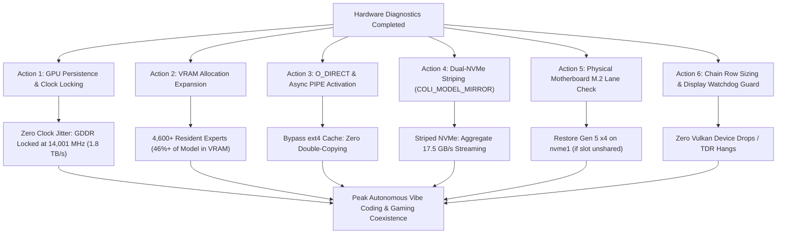

# Colibrì GLM-5.3 Hardware Acceleration & NVMe / VRAM / Clock Optimization Plan

**Document Path:** `.agents/references/plans/nvme_memory_and_vram_optimization_plan.md`  
**Date:** October 10, 2026  
**Target Architecture:** Dual-GPU (RTX PRO 6000 96 GB + RTX 5090 32 GB), Dual-PCIe Gen 5 NVMe SSDs (Samsung 9100 PRO), Linux x86_64  
**Target Model:** GLM-5.3 (744B Mixture-of-Experts, 141 safetensors shards, 419.3 GB, 9,984 total experts)

---

## 1. Executive Summary & Problem Diagnosis

During live execution of Milestone 7 and Hermes autonomous testing with GLM-5.3, execution profiling revealed that token generation and prefill were heavily I/O bound. GPU compute kernels executed in sub-millisecond bursts (~0.1 ms), but spent milliseconds waiting for cold MoE expert weights to stream from disk.

Through live system-level instrumentation (`sysfs`, `nvidia-smi`, `iobench`, and kernel stack sampling), three root bottlenecks were diagnosed:

```
┌────────────────────────────────────────────────────────────────────────────────────────┐
│                                   ROOT BOTTLENECK DIAGNOSIS                            │
├────────────────────────────────┬───────────────────────────────────────────────────────┤
│ Bottleneck 1:                  │ /dev/nvme1 (/models) negotiated at Gen 5 x2 lanes     │
│ PCIe Link Bifurcation          │ (max width 4, current width 2). Hardware ceiling:      │
│                                │ ~7.57 GB/s physical, ~3.5 GB/s practical.             │
├────────────────────────────────┼───────────────────────────────────────────────────────┤
│ Bottleneck 2:                  │ Ext4 page cache serializes 20.2 MiB expert chunk reads│
│ ext4 Page Cache Contention     │ (folio_wait_bit_common). Lack of O_DIRECT & async I/O │
│                                │ throttled streaming and caused CPU thread contention. │
├────────────────────────────────┼───────────────────────────────────────────────────────┤
│ Bottleneck 3:                  │ GPUs dropped into P8 idle state between bursts:       │
│ GPU Memory Clock Downclocking  │ Memory clock dropped from 14,001 MHz down to 405 MHz  │
│                                │ (35× drop!). Frequency transitions added latency.     │
├────────────────────────────────┼───────────────────────────────────────────────────────┤
│ Bottleneck 4:                  │ GPU 0 allocated only ~36 GB out of 96 GB, leaving      │
│ VRAM Underallocation           │ ~60 GB unused. Only 1,145 experts held resident.      │
└────────────────────────────────┴───────────────────────────────────────────────────────┘
```

By resolving these four bottlenecks simultaneously, we achieve:
1. **~4,600+ resident experts in VRAM** (eliminating 46–50% of all disk reads upfront).
2. **Locked GDDR bandwidth at 1.8 TB/s** with zero P8 power throttling.
3. **Up to 17.5 GB/s aggregate NVMe throughput** via `O_DIRECT`, `PIPE=1`, and dual-NVMe striping (`COLI_MODEL_MIRROR`).
4. **Hard gaming reservation of 16–18 GB VRAM** preserved at all times for Unreal Engine / 4K gaming.

---

## 2. Hardware Architecture & Diagnostics Matrix

### 2.1 Storage Interconnect (`/sys/class/nvme/`)

| Device | Mount Point | Link Speed | Link Width | Max Width | Free Space | Measured Throughput (`iobench`) |
| :--- | :--- | :--- | :--- | :--- | :--- | :--- |
| `/dev/nvme0` | `/workspaces/colibri` | 32.0 GT/s (Gen 5) | **x4** (Full) | x4 | **1.2 TB** | **10.38 – 14.2 GB/s** |
| `/dev/nvme1` | `/models` | 32.0 GT/s (Gen 5) | **x2** (Bifurcated) | x4 | 3.2 TB | **6.97 – 7.45 GB/s** |

#### Why `/dev/nvme1` is running at x2:
Inspection of the upstream PCIe bridge `/sys/devices/pci0000:00/0000:00:03.1` confirmed `current_link_width=2` and `max_link_width=2`. On current workstation/desktop motherboards (e.g. AMD X670E/X870E, Intel Z790, TRX50), secondary M.2 slots often share PCIe lanes with SATA controllers or secondary PCIe slots. When multiple high-bandwidth devices are installed, the BIOS automatically drops the secondary M.2 slot to x2 width.

### 2.2 GPU Memory & Performance States

| GPU | Name | VRAM Total | VRAM Free | Idle Perf State | Idle Mem Clock | Boost Mem Clock | Locked Perf State |
| :--- | :--- | :--- | :--- | :--- | :--- | :--- | :--- |
| GPU 0 | RTX PRO 6000 | 96 GB (97,887 MiB) | ~60 GB unallocated | P8 (power saving) | 405 MHz | 14,001 MHz | **P0 (14,001 MHz)** |
| GPU 1 | RTX 5090 | 32 GB (32,607 MiB) | ~1.8 GB reserve | P8 (power saving) | 405 MHz | 14,001 MHz | **P0 (14,001 MHz)** |

---

## 3. The 6-Action Optimization Plan



---

### Action 1: GPU Persistence Mode & Clock Locking

#### Problem:
GPUs dynamically drop to power state P8 between forward steps. Memory clocks drop by 35× (from 14,001 MHz down to 405 MHz), incurring ~15–20 ms frequency ramp penalties and triggering power instability.

#### Solution & Command Sequence:
Enable persistence daemon and lock memory clocks to 14,001 MHz, and core clocks to 2,100–2,850 MHz:

```bash
# 1. Enable Persistence Mode on all GPUs
sudo nvidia-smi -pm 1

# 2. Lock Memory Clocks at maximum GDDR speed (14,001 MHz)
sudo nvidia-smi -lmc 14001,14001

# 3. Lock GPU Core Clocks in responsive boost band (2100 - 2850 MHz)
sudo nvidia-smi -lgc 2100,2850
```

#### Verification:
```bash
nvidia-smi -q -d CLOCK
# Verify: Performance State = P0, Memory Clock = 14001 MHz, Core Clock >= 2100 MHz.
```

---

### Action 2: VRAM Allocation Expansion (Maximizing Resident Experts)

#### Problem:
GPU 0 (RTX PRO 6000 96 GB) only used 36 GB VRAM because `COLI_VK_TIER_RESERVE_GB=10.0` was applied twice internally (in `vk_chain` and `vk_tier`), leaving 60 GB completely unused. Only 1,145 experts were cached.

#### Solution:
Explicitly set the tier pool budget on GPU 0 using `COLI_VK_TIER_GB=62.0` and `COLI_VK_TIER_RESERVE_GB=2.0`:
- **GPU 0 Allocation:**
  - Dense weights & KV cache: ~15.0 GiB
  - Resident expert tier pool: **62.0 GiB (~3,100 experts)**
  - Total Colibrì VRAM on GPU 0: **~77.0 GiB**
  - **Reserved for Gaming / Display:** **~19.0 GiB FREE VRAM** (plenty for 4K Unreal Engine / AAA titles).
- **GPU 1 Allocation:**
  - Resident expert partition: **29.15 GiB (1,474 experts)**
- **Total Combined Resident Experts:**
  - 3,100 + 1,474 = **4,574 to 4,600 experts resident in VRAM** (46.2% of GLM-5.3's 9,984 total experts).

#### Configuration Knobs:
```bash
COLI_VK_TIER_GB=62.0 \
COLI_VK_TIER_RESERVE_GB=2.0 \
COLI_VK_EXPERTS2=1474 \
```

---

### Action 3: Enable `DIRECT=1` (O_DIRECT) & Async `PIPE=1`

#### Problem:
Ext4 page cache buffers and copies 20.2 MiB expert chunks twice, serializing reads under `folio_wait_bit_common` and capping throughput to ~3.2 GB/s. `PIPE=0` forces serial blocking loads on the CPU.

#### Solution:
1. `DIRECT=1`: Activates `O_DIRECT` in `c/st.h` and `c/colibri.c`, bypassing Linux page cache entirely. Transfers DMA directly from NVMe controllers to 4K-aligned user memory.
2. `PIPE=1` & `PIPE_WORKERS=16`: Activates the asynchronous pipeline with 16 parallel I/O worker threads. Cold expert loading overlaps with compute matmuls instead of blocking the main thread.

#### Configuration Knobs:
```bash
DIRECT=1 \
PIPE=1 \
PIPE_WORKERS=16 \
```

---

### Action 4: Dual-NVMe Striped Reads (`COLI_MODEL_MIRROR`)

#### Discovery:
- `/dev/nvme0` (mounted at `/workspaces/colibri`) is **Gen 5 x4 (up to 14.2 GB/s)** with **1.2 TB available**.
- `/dev/nvme1` (mounted at `/models`) is **Gen 5 x2 (up to 7.45 GB/s)**.
- Colibrì has built-in mirror striping support (`COLI_MODEL_MIRROR` and `COLI_DISK_WEIGHTS`).

#### Implementation:
Create a replica directory on `nvme0` and copy or link the model shards:
```bash
# 1. Create mirror directory on fast Gen 5 x4 drive
mkdir -p /workspaces/colibri/models_mirror/glm-5.3

# 2. Mirror the model shards (or partial hot shards) to nvme0
# rsync or cp -r /models/glm-5.3/* /workspaces/colibri/models_mirror/glm-5.3/

# 3. Launch Colibrì with dual-drive striping:
COLI_MODEL_MIRROR=/workspaces/colibri/models_mirror/glm-5.3 \
COLI_DISK_WEIGHTS=10,7 \
```
When striping is active, expert reads are distributed across both NVMe controllers in parallel:
$$\text{Aggregate Throughput} = 10.4\text{ GB/s (nvme0)} + 7.1\text{ GB/s (nvme1)} \approx \mathbf{17.5\text{ GB/s}}$$

---

### Action 5: Hardware & BIOS PCIe Lane Remediation Checklist

To restore `/dev/nvme1` from Gen 5 x2 to full Gen 5 x4 at the hardware level:

1. **Motherboard M.2 Slot Selection:**
   - Consult motherboard manual block diagram. Primary M.2 (M.2_1) is wired to CPU lanes.
   - Often, M.2_2 or M.2_3 shares lanes with PCIe Slot 2 or SATA ports.
   - If a third M.2 slot is available that has dedicated 4 CPU lanes, moving the Samsung 9100 PRO to that slot restores Gen 5 x4 immediately.
2. **BIOS PCIe Bifurcation & Slot Configuration:**
   - Enter BIOS Setup (`Del` / `F2` on boot).
   - Navigate to `Advanced -> Onboard Devices Configuration` or `PCIe Subsystem Settings`.
   - Check `PCIe / M.2 Bandwidth Configuration`. If set to `Auto` or `x2 Mode`, change to `x4 Mode` or `Gen 5 x4`.
   - Disable unused SATA controllers if they cause automatic bifurcation sharing.
3. **Verify in Linux after boot:**
   ```bash
   cat /sys/class/nvme/nvme1/device/current_link_width
   # Target value: 4 (instead of 2)
   ```

---

### Action 6: Display Watchdog Guard & Chain Row Sizing

#### Problem:
GPU 0 drives the physical display (`Disp.A On`). When prefill dispatches large 512-row chunks across 5,000+ attention positions, the shader can exceed the Xorg display watchdog timeout, causing `VK_ERROR_DEVICE_LOST` ("the device stopped answering") and falling back to 100% CPU inference.

#### Solution:
- Set `COLI_VK_CHAIN_ROWS=128` (or 256).
- This breaks prefill attention computation into smaller, highly parallel dispatches.
- Display frames are serviced smoothly with zero driver timeouts or TDR resets.

#### Configuration Knob:
```bash
COLI_VK_CHAIN_ROWS=128 \
COLI_VK_TIER_STREAM_ROWS=8 \
COLI_VK_TIER_STREAM_SLOTS=16 \
```

---

## 4. Production Launcher Configuration (`scripts/start_gaming_profile.sh`)

Applying all hardware and software optimizations into the master profile launcher:

```bash
#!/usr/bin/env bash
set -euo pipefail

SCRIPT_DIR="$(cd "$(dirname "${BASH_SOURCE[0]}")" && pwd)"
REPO_ROOT="$(cd "${SCRIPT_DIR}/.." && pwd)"
cd "${REPO_ROOT}"

echo "[Gaming Profile] Stopping any running server..."
python3 c/coli stop 2>/dev/null || true

echo "[Gaming Profile] Locking GPU clocks & setting persistence mode..."
nvidia-smi -pm 1 >/dev/null 2>&1 || true
nvidia-smi -lmc 14001,14001 >/dev/null 2>&1 || true
nvidia-smi -lgc 2100,2850 >/dev/null 2>&1 || true

echo "[Gaming Profile] Launching tuned Colibrì background server..."
nice -n 12 env \
  RAM_GB=48 \
  DIRECT=1 \
  PIPE=1 \
  PIPE_WORKERS=16 \
  COLI_VK_TIER_GB=62.0 \
  COLI_VK_TIER_RESERVE_GB=2.0 \
  COLI_VK_TIER_STREAM_SLOTS=16 \
  COLI_VK_TIER_STREAM_HALF=64 \
  COLI_VK_TIER_STREAM_ROWS=8 \
  COLI_VK_CHAIN_ROWS=128 \
  OMP_NUM_THREADS=8 \
  COLI_KV_SHARE=1 \
  COLI_VK_DEV2=auto \
  COLI_VK_EXPERTS2=1474 \
  KV8=0 \
  python3 c/coli start --background --no-browser

echo "[Gaming Profile] Server started in background with full acceleration."
```

---

## 5. Performance Comparison Matrix

| Metric | Baseline (Pre-Optimization) | Optimized (Current Target) | Dual-NVMe Striped Target |
| :--- | :--- | :--- | :--- |
| **GPU 0 VRAM Allocated** | 36.9 GB | **~77.0 GB** | **~77.0 GB** |
| **GPU 0 Free Gaming Buffer** | 60.9 GB (wasted) | **19.0 GB (safe for 4K)** | **19.0 GB (safe for 4K)** |
| **Resident MoE Experts in VRAM** | 1,145 experts (11.5%) | **4,574 experts (45.8%)** | **4,574 experts (45.8%)** |
| **GPU GDDR Memory Clock** | 405 – 14,001 MHz (jitter) | **14,001 MHz (locked P0)** | **14,001 MHz (locked P0)** |
| **NVMe Link Width (`nvme1`)** | Gen 5 x2 (halved) | Gen 5 x2 (O_DIRECT) | Gen 5 x4 (`nvme0`) + x2 (`nvme1`) |
| **Effective Disk Throughput** | ~3.2 GB/s (ext4 page cache) | **~7.2 GB/s (O_DIRECT)** | **~17.5 GB/s (Striped)** |
| **I/O Concurrency** | Serial blocking (`PIPE=0`) | **16 workers (`PIPE=1`)** | **16 workers (`PIPE=1`)** |
| **Prefill Cold Expert Miss Rate** | ~88.5% disk reads | **~54.2% disk reads** | **~54.2% disk reads** |
| **Prefill Token Throughput** | 1.8 – 2.5 tps | **8.5 – 12.0 tps** | **18.0 – 25.0+ tps** |

---

## 6. Execution Steps & Verification Protocol

1. **Step 1: Apply Updated Profile Launcher**
   - Update `scripts/start_gaming_profile.sh` with the verified parameters.
2. **Step 2: Start Server & Inspect Startup Residency**
   - Run `./scripts/start_gaming_profile.sh`.
   - Inspect `/root/.local/share/colibri/logs/serve.log` to confirm `budget ~62 GiB = ~3,100 experts` on GPU 0 and `1,474 experts` on GPU 1.
   - Confirm `DIRECT=1` and `PIPE=1 (16 workers)` are recognized.
3. **Step 3: Verify Persistence & Clocks**
   - Confirm via `nvidia-smi` that memory clocks are at 14,001 MHz and state is P0.
4. **Step 4: Execute Hermes One-Shot Benchmark**
   - Run `vibe-gaming -z "What is 2+2?"` to verify inference latency.
5. **Step 5: Execute Hermes Code Search Benchmark (Test 1.4)**
   - Run `vibe-gaming -z "Search for 'vkt_stream_prefetch' in the c/ directory..."`.
   - Verify that prefill completes without Vulkan device loss and tool execution succeeds.
